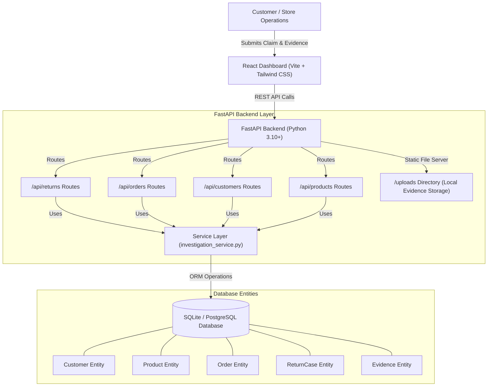
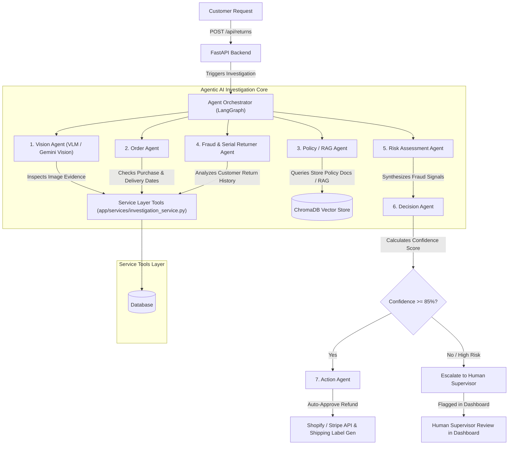

# ReturnShield AI — System Architecture

This document describes the architectural roadmap of **ReturnShield AI**, from the foundational infrastructure built in **Step 1** to the multi-agent AI investigation system coming in **Step 2+**.

---

## 1. Step 1 Architecture (Current Foundation)

In Step 1, the system establishes a robust, type-safe data model, service layer, REST endpoints, and an operational dashboard for human supervisors.

### Data Flow in Step 1
1. **Claim Submission**: Customer or admin submits order ID, return reason, complaint description, and optional evidence photos via the **New Investigation** form.
2. **Case Creation**: The backend generates a unique case ID (e.g. `RET-2026-0001-A9F1`), records the claim in SQLite, and saves uploaded evidence photos to `/uploads`.
3. **Dashboard Monitoring**: Operations supervisors inspect recent claims, view entity relationships (Customer, Order, Product details), check evidence images, and override case statuses manually.

---

## 2. Step 2+ Architecture (Future Autonomous AI Agent Roadmap)

In Step 2 and beyond, an autonomous multi-agent engine will sit between FastAPI and the database service layer to investigate claims autonomously.

---

## 3. Tool Mapping for Future Agents

The service functions created in `backend/app/services/investigation_service.py` are mapped to future agents as follows:

| Agent | Service Function / Tool | Purpose |
| :--- | :--- | :--- |
| **Vision Agent** | `get_return_case()` | Access evidence file paths and inspect image pixels for damage/fraud |
| **Order Agent** | `get_order_details()` | Validate order delivery date, return window eligibility, and item cost |
| **Policy / RAG Agent** | `get_product_details()` | Retrieve warranty terms and product category return rules |
| **Fraud Agent** | `get_customer_history()`, `get_customer_return_history()` | Scan historical return frequency, claim total value, and abuse patterns |
| **Decision Agent** | `add_investigation_result()` | Record structured agent findings and risk scores |
| **Action Agent** | `update_return_case()` | Update status to Approved/Rejected and issue refund payload |

---

## 4. Key Security & Operational Controls
- **Auditability**: Every decision (autonomous or human override) is recorded in `return_cases`.
- **Human-in-the-Loop**: High-risk or ambiguous cases are escalated to the `Needs Human Review` status for supervisor override in the dashboard.
- **Strict Separation**: Foundation endpoints remain 100% operational with or without AI agent runtime active.
